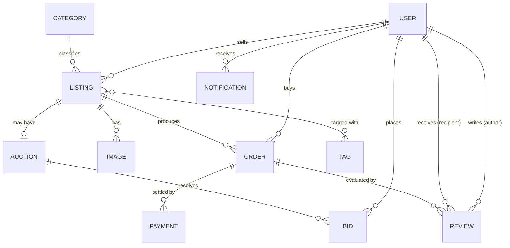

# Yala — Marketplace de Subastas de Coleccionables Geek

> Backend REST para un marketplace LATAM de coleccionables geek (Pokémon TCG, Funko Pops, comics) con subastas en tiempo real, compra directa, sistema de reputación y pagos integrados.

**Curso:** CS 2031 — Desarrollo Basado en Plataformas (UTEC)
**Ciclo:** 2026-1
**Integrantes:** Kate Alva · Sebastian Ramos · Israel Carlos

---

## Índice

1. [Introducción](#introducción)
2. [Identificación del problema o necesidad](#identificación-del-problema-o-necesidad)
3. [Descripción de la solución](#descripción-de-la-solución)
4. [Modelo de entidades](#modelo-de-entidades)
5. [Testing y manejo de errores](#testing-y-manejo-de-errores)
6. [Medidas de seguridad implementadas](#medidas-de-seguridad-implementadas)
7. [Eventos y asincronía](#eventos-y-asincronía)
8. [GitHub & management](#github--management)
9. [Conclusión](#conclusión)
10. [Apéndices](#apéndices)

---

## Introducción

### Contexto

El coleccionismo geek vive un auge sostenido en LATAM impulsado por la consolidación de comunidades en redes sociales y el regreso de franquicias clásicas (Pokémon, Marvel, anime). Sin embargo, los coleccionistas hispanohablantes intercambian piezas mayormente a través de grupos de Facebook o WhatsApp, plataformas que **no escalan, no garantizan el cobro, no verifican autenticidad y no manejan subastas en tiempo real**. **Yala** nace para llenar ese vacío con un backend especializado.

### Objetivos del proyecto

- Construir un backend REST completo con autenticación JWT y autorización por roles (`USER`, `SELLER`, `ADMIN`).
- Implementar subastas en tiempo real con WebSockets, eventos asíncronos y un *scheduler* que cierra subastas vencidas.
- Integrar tres servicios externos: **Mercado Pago** (pagos), **AWS S3** (imágenes) y **Resend** (correos transaccionales).
- Mantener cobertura de pruebas automatizadas alta sobre *services* y *controllers*.
- Documentar la API en un `openapi.yaml` estático que viva en el repo.

---

## Identificación del problema o necesidad

### Descripción del problema

Los canales actuales para subastar y vender coleccionables en LATAM presentan tres carencias críticas: **(1)** no existe un registro de reputación entre comprador y vendedor, lo que aumenta el fraude y la incertidumbre; **(2)** las subastas se manejan manualmente (publicaciones con comentarios y captura final por el vendedor), generando disputas y errores de cierre; y **(3)** no hay verificación de autenticidad ni de identidad del vendedor, exponiendo al comprador a falsificaciones. Los marketplaces generalistas (Mercado Libre, OLX) tampoco resuelven este nicho porque mezclan categorías, no soportan pujas en tiempo real y carecen de filtros específicos (condición PSA, ediciones limitadas, *holos*).

### Justificación

Resolver este problema permite **profesionalizar un mercado en crecimiento**, reducir el fraude y dar a los vendedores una vitrina especializada con herramientas que hoy solo existen en plataformas en inglés (eBay, PWCC). Yala apunta a esa brecha con subastas confiables, escrow vía Mercado Pago, sistema de reputación basado en reseñas verificadas y verificación de vendedores.

---

## Descripción de la solución

### Funcionalidades implementadas

- ✓ **Auth**: registro, login y refresh-token con JWT (access 1 h, refresh 7 días).
- ✓ **Listings**: publicaciones en modo `FIXED` (precio fijo) o `AUCTION` (subasta), con paginación, búsqueda por texto y filtros por categoría, tags, precio y condición.
- ✓ **Auctions**: subastas con precio inicial, fecha de cierre y un `AuctionScheduler` (`@Scheduled` cada 60 s) que las finaliza automáticamente y asigna ganador.
- ✓ **Bids**: pujas con validación estricta (`amount > currentPrice`, subasta `ACTIVE`, `endsAt > now()`); broadcast WebSocket en `/topic/auction/{id}`.
- ✓ **Orders**: compra directa sobre listings `FIXED` y auto-creación de orden al cerrar una subasta con pujas.
- ✓ **Payments**: integración con Mercado Pago Preference + webhook IPN para reconciliar estados.
- ✓ **Reviews**: reseñas (1–5 estrellas) sobre órdenes `CONFIRMED`; recalcula reputación del destinatario.
- ✓ **Images**: subida a AWS S3 (máximo 5 por listing).
- ✓ **Notifications**: bandeja in-app, WebSocket `/topic/notifications/{userId}` y correo HTML vía Resend.
- ✓ **Categories & Tags**: catálogos administrados por `ADMIN`.

En total: **12 controllers REST**, **41 endpoints**, **27 DTOs** con `@Schema` documentado.

### Tecnologías utilizadas

| Capa | Tecnologías |
|---|---|
| Lenguaje / framework | Java 21, Spring Boot 4.0.6 |
| Persistencia | JPA / Hibernate, PostgreSQL (RDS en prod, Docker local) |
| Seguridad | Spring Security 6, JWT (jjwt 0.12.5), BCrypt |
| Tiempo real | Spring WebSocket + STOMP |
| Async / scheduling | `@Async`, `@EventListener`, `@Scheduled`, `ThreadPoolTaskExecutor` |
| Docs API | SpringDoc OpenAPI 3.0.2 + Swagger UI |
| APIs externas | Mercado Pago SDK 2.1.21, AWS SDK v2 (S3), Resend 4.11.0 |
| Mapping | ModelMapper 3.2.1 |
| Tests | JUnit 5, Mockito, Testcontainers (PostgreSQL), Spring Security Test |
| Build & CI | Maven, GitHub Actions |

---

## Modelo de entidades

### Descripción de entidades

- **User** — coleccionistas y vendedores. Atributos clave: `email` (único), `passwordHash` (BCrypt), `role`, `reputation`, `isVerifiedSeller`.
- **Listing** — la unidad de venta. Lleva `mode` (FIXED / AUCTION), `condition`, `status` y enlaces a `Category`, `Tag`s e `Image`s.
- **Auction** — subasta vinculada 1:1 con un Listing; mantiene `startingPrice`, `currentPrice`, `endsAt`, `status`, `winner`.
- **Bid** — puja registrada por un usuario sobre una subasta; el `amount` debe superar al `currentPrice`.
- **Order** — orden de compra creada por compra directa o por cierre de subasta. Transiciona `PENDING → CONFIRMED | CANCELLED`.
- **Payment** — pago vía Mercado Pago vinculado a una orden, con `externalReference` (preferenceId) y `status` (PENDING / SUCCESS / FAILED / REFUNDED).
- **Review** — reseña post-orden con `rating` 1–5; recalcula reputación del recipient.
- **Notification** — mensaje in-app tipado (`BID_OUTBID`, `AUCTION_WON`, `SALE_CONFIRMED`, `NEW_BID`).
- **Category / Tag / Image** — catálogos y media auxiliares.

---

## Testing y manejo de errores

### Niveles de testing realizados

- **Unitarias** sobre *services* con **Mockito** (mock de repos, mappers y eventos): aíslan la lógica de negocio.
- **Slice tests**: `@WebMvcTest` para *controllers* (MockMvc + Spring Security Test) y `@DataJpaTest` para *repositories* con **Testcontainers PostgreSQL** (Postgres real efímero, no H2).
- **Integración**: `@SpringBootTest` para verificar `EventListeners` y la cadena async completa.
- **Convención BDD obligatoria**: `should{ExpectedBehavior}When{Condition}()` (p. ej. `shouldThrowInvalidBidExceptionWhenAmountIsLowerThanCurrentPrice`).

### Resultados

**187 tests pasando**, 0 fallos. Errores reales encontrados y corregidos durante el desarrollo: `LazyInitializationException` al disparar eventos fuera de transacción (resuelto con `@Transactional` + recarga por id), columnas duplicadas en *cascade* JPA, validación incorrecta de roles, condiciones de carrera en el cierre del scheduler.

### Manejo de errores

Centralizamos todo en `GlobalExceptionsHandler` (`@RestControllerAdvice`) con un record `ErrorResponse(timestamp, status, error, message, path)` uniforme. Definimos **9 excepciones de dominio** (`InvalidBidException`, `AuctionNotActiveException`, `OrderNotConfirmableException`, `EmailAlreadyExistsException`, `PaymentException`, `ReviewNotAllowedException`, `ImageLimitExceededException`, `ResourceNotFoundException`, `UnauthorizedException`) más handlers para `MethodArgumentNotValidException`, `HttpMessageNotReadableException`, `AccessDeniedException` y un *fallback* `Exception` → 500. Cada excepción mapea a un HTTP status semántico (400/403/404/409/502). Centralizar evita `try/catch` dispersos y garantiza un payload de error consistente para el cliente.

---

## Medidas de seguridad implementadas

### Seguridad de datos

- **Autenticación**: JWT firmado HS256 con secret vía `JWT_SECRET` (env var, nunca hardcoded). Claims: `sub` (email), `userId`, `role`. Tokens de acceso (1 h) y de refresco (7 días).
- **Autorización**: `@EnableMethodSecurity` + `@PreAuthorize("hasRole('SELLER') or hasRole('ADMIN')")` sobre endpoints sensibles. Configuración stateless (`SessionCreationPolicy.STATELESS`).
- **Hashing**: contraseñas con **BCrypt** en el registro; `passwordHash` **nunca** aparece en `ResponseUserDTO` ni en logs.
- **Gestión de permisos**: tres roles (`USER`, `SELLER`, `ADMIN`) propagados en el JWT y validados por endpoint.

### Prevención de vulnerabilidades

- **Inyección SQL**: 100 % JPA/queries parametrizadas, sin SQL crudo concatenado.
- **XSS**: respuestas exclusivamente JSON (no renderiza HTML); Bean Validation (`@Email`, `@Size`, `@Pattern`) en cada entrada.
- **CSRF**: deshabilitado por diseño — API stateless con Bearer Token (no cookies).
- **Webhook Mercado Pago**: público pero verifica firma con `mercadopago.webhook-secret`.
- **Secrets**: todos vía variables de entorno (`AWS_*`, `MP_*`, `RESEND_API_KEY`).

---

## Eventos y asincronía

Yala usa **Spring Events** para desacoplar efectos colaterales del request HTTP principal. Tres eventos centrales:

- **`NewBidEvent`** — al registrar una puja: notifica al pujador superado (notificación + email Resend) y broadcastea precio actualizado en `/topic/auction/{id}`.
- **`AuctionFinishedEvent`** — al cerrar una subasta: marca `status = FINISHED`, asigna `winner`, crea `Order` PENDING, notifica ganador y vendedor, broadcastea resultado final.
- **`OrderConfirmedEvent`** — al confirmar la orden: notifica al comprador y recalcula la reputación del vendedor sumando todas sus reseñas.

### Por qué son asíncronos

El handler HTTP devuelve 201/200 **sin esperar** a que se envíen emails, notificaciones in-app o mensajes WebSocket. Una llamada a Resend puede tardar 1–3 segundos; bloquear el hilo del request degradaría la experiencia y comprometería la concurrencia. `AsyncConfig` configura un `ThreadPoolTaskExecutor` (`core=4`, `max=10`, `queue=100`, prefix `yala-async-`) y los listeners se anotan con `@Async @EventListener`.

Adicionalmente, `AuctionScheduler.closeExpiredAuctions()` corre con `@Scheduled(fixedRate = 60000)` buscando subastas vencidas y publicando `AuctionFinishedEvent` para procesarlas en background.

---

## GitHub & management

- **Issues**: cada feature, refactor o fix abre un Issue en GitHub (ej. `#82` transactional events, `#84` arquitectura por capas, `#86` openapi.yaml, `#88` README). Esto crea trazabilidad commit → issue → PR.
- **Branching git-flow**: ramas `feature/<N>-<slug>` salen de `develop`, se mergea via PR a `develop`. `main` queda como rama estable.
- **Commits**: convenciones convencionales en español (`feat:`, `fix:`, `refactor:`, `docs:`, `build:`, `chore:`) con referencia explícita al issue (`refs #N` / `Closes #N`).
- **Pull Requests**: cada PR pasa CI antes de merge; revisión por al menos un compañero.

### GitHub Actions

`.github/workflows/ci.yml` define el pipeline de integración continua:

- **Triggers**: `push` sobre `main`/`develop`, `pull_request` hacia esas ramas, y `workflow_dispatch` manual.
- **Job `build-and-test`** sobre `ubuntu-latest`: checkout → setup JDK 21 Temurin → `mvn clean verify`.
- **Servicio Postgres** levantado por el job (`services:` con `postgres:15` y healthcheck) para los tests de Testcontainers.
- **Variables de entorno**: `DATABASE_URL`, `DB_USER`, `DB_PASS`, `JWT_SECRET` inyectadas al runner.

Esto garantiza que ningún PR llega a `develop` sin que los 187 tests pasen.

---

## Conclusión

### Logros del proyecto

- Backend funcional end-to-end con **41 endpoints REST**, **187 tests verdes**, documentación OpenAPI en `openapi.yaml` y arquitectura por capas técnicas (controller/service/repository/model/dto).
- Integración real con **3 APIs externas** (Mercado Pago, AWS S3, Resend) sin fricción.
- Sistema de eventos asíncronos + scheduler que cierra subastas sin intervención manual.

### Aprendizajes clave

- **Spring Events + `@Async`** son la forma natural de mantener controllers rápidos y desacoplar efectos colaterales (emails, notificaciones, broadcasts).
- **Testcontainers** elimina la divergencia entre H2 (mock) y Postgres (prod) que en proyectos pasados causó bugs en migraciones.
- Refactor de paquetes por feature a capas técnicas (90 archivos movidos en un PR) reveló el costo de **no fijar la arquitectura desde el día 1**.
- **SpringDoc OpenAPI** simplifica la documentación, pero requiere disciplina en `@Schema`, `@Operation` y `@Tag` para que el yaml resultante sea útil.

### Trabajo futuro

- *Rate limiting* por usuario (Bucket4j) sobre endpoints públicos.
- Revocación de JWT con Redis para sesiones invalidadas.
- Frontend React + STOMP client para consumir las subastas en tiempo real.
- Métricas con Micrometer + Prometheus + Grafana.
- Migrar `AuctionScheduler` a Quartz para soporte de despliegue distribuido.

---

## Apéndices

### Licencia

Proyecto académico desarrollado para el curso **CS 2031 — Desarrollo Basado en Plataformas (UTEC, ciclo 2026-1)**. No se distribuye bajo licencia open source: el código se comparte con fines educativos y de evaluación, no para uso comercial.

### Referencias

- Spring Boot 4 Reference Documentation
- Spring Security 6 Reference
- JWT RFC 7519
- OpenAPI Specification 3.1.0
- Mercado Pago Checkout Pro Documentation
- AWS SDK for Java v2 Documentation
- Resend API Documentation
- Testcontainers for Java Documentation
